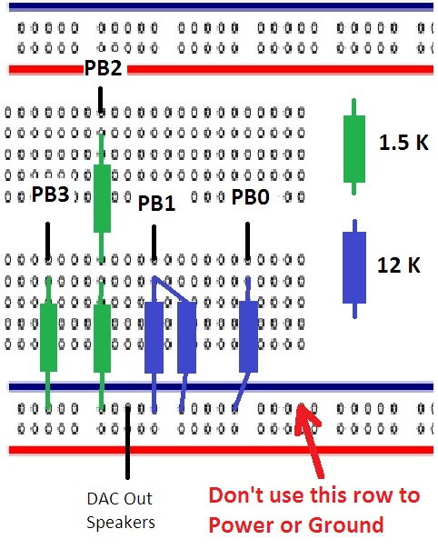

# Lab 13

> DAC and Sound

## Learning Objectives

* Develop a means for a digital computer to interact with the analog world.
* Study digitization: Quantization, range, precision and resolution.
* Introduce sampling and the Nyquist Theorem.
* Study the basics of sound: electromagnets, speakers, AC vs. DC power, perception of sound.
* Understand how to create sound: loudness, pitch, envelope, and shape
* Use SysTick to create sounds by programming variable frequencies.

## About the lab

The lab was designed to cement the understanding of interrupts, I/O, and DAC.
The input to the MCU consists of 4 push buttons that represent piano keys.
The output from the MCU is a set of voltages representing music notes.

The code flow is:

1. Initialize Systick, DAC pins and button pins.
2. Continuously check to see if a button is pressed.
3. If a button is pressed, identify which one and adjust the RELOAD value of the SysTick.
4. If a button isn't pressed, write a zero to the DAC.

In the systick interrupt handler:

1. Check the global `g_pianoKey` which holds the status of which piano key is being pressed.
2. If the `g_pianoKey` value is not 4, then call `Sound_Play()` to output a sine wave.

> Unfortunately I didn't get a cool video of this one.

 

 

 

### Lessons Learned

This one was a tough one for hardware. I did some reading on understanding schematics
and a quick refresh on Ohm's Law. Once I got the basics down I couldn't figure out
how to wire up my resistors for the DAC. I understood on paper how it worked but
I couldn't figure out how to do it in HITL. In the end I got help from the 
course instructors and they suggested I refactor my assembly to this:

 

 

Another huge lesson learned was that after I had all my stuff setup correctly
the frequency of the waveform I was getting out of the DAC was _way_ off the
target frequency for the piano notes. After spending all day troubleshooting with
one of the course TA's I refactored my whole assembly in order to clean it up and
it worked. The TA and I believe it was probably a faulty wire that was the issue.